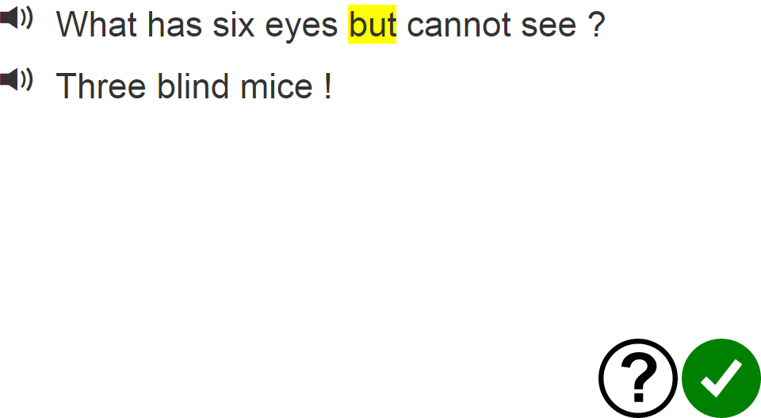
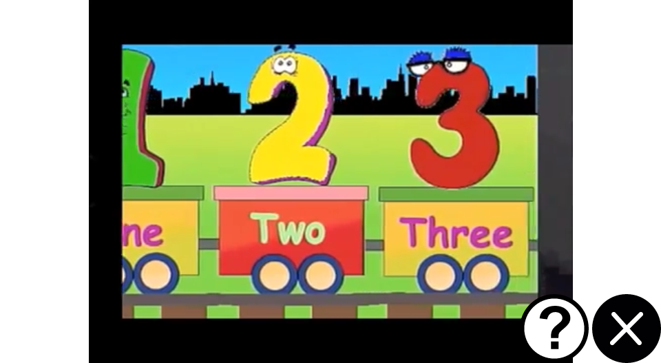

# Features

## Social Feed

Users select tasks to do from their social feed. The feed displays a large avatar of the poster (either the system or one of their peer), with small avatars of users who have completed the task.

When a task is completed, users are taken to a sharing screen, where they have the option of sharing the task they completed with one of their peers.

In addition, the task that was completed is marked with a checkmark and bumped to the front of the feed, and another task of that same type (with a higher difficulty) is then inserted to the front of the feed, and another task of a different type (that has not yet been completed, and is of the next difficulty level within that task) is also inserted.

## Activities

### Fill in the blank social version

This activity allows you to respond, using a fixed vocabulary of words, to a question. Built-in questions are currently of the format "What is your favorite animal/color/fruit", though any fill-in-the-blank question that can be answereed using a fixed vocabulary of words can be used. (We enforce a fixed vocabulary to ensure that users don't enter garbage text). When you send the activity to another user, it will display your response and prompt them for their response. Becuase the prompt is given by a peer rather than just a machine, and playing the activity lets users learn more about their peers, we hope that this increases engagement.

### Fill in the blank basic version

This is a control version of the above activity, where the user is simply asked to fill in the blank using a fixed vocabulary of words. Sharing will send the question, but not their response.

### Read sentence aloud

Users can use speech synthesis to help them read jokes. Whenever they don't recognize a word, tapping it will read it out loud. There is also a sentence-level reading option, whereby tapping the speaker icon will read the entire sentence out loud.

### Type word

Users type words on a keyboard where the keys are grouped according to phonetic properties and similarity to enhance ease of memorizing the keyboard layout. Progressively more of the keyboard is revealed each time they enter the word, increasing the task difficulty.

### Type letter

Users type the first letter of a word on a keyboard where the keys are grouped according to phonetic properties and similarity to enhance ease of memorizing the keyboard layout. Progressively more of the keyboard is revealed each time the letter is entered, increasing the task difficulty.

### Dots

Users perform multiplication, by selecting dots on a rectangular grid to match a target multiplication formula.

### Balance

Users are provided with a number on a balance, and drag items onto it to match it in weight. Items are available in groups of 1, 10, and 100.

### Addition

Users perform addition, by dragging bars to match the length of a target bar.

### Bars

Users rearrange bars into ascending order by length.

### Videos

#### Letter Videos

A video sequence which introduces the 26 letters of the alphabet. From https://www.youtube.com/watch?v=y8pZ3F8KB_Y&list=PLDt4VQajKv8zYrZxZwjWDfii4rQPCB-XE

#### Number Videos

A video sequence which introduces the numbers 1 to 100. From https://www.youtube.com/watch?v=pbRU3lsGS0M&list=PLB621C403A3E4BDB0

